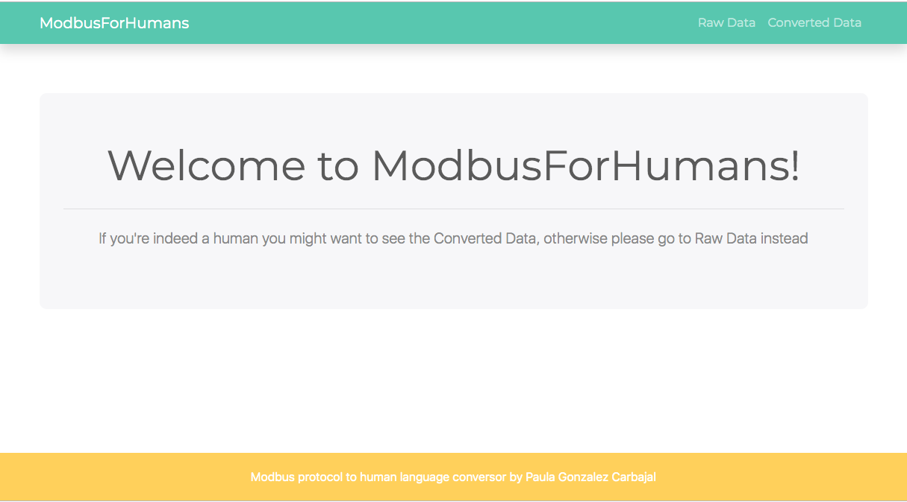
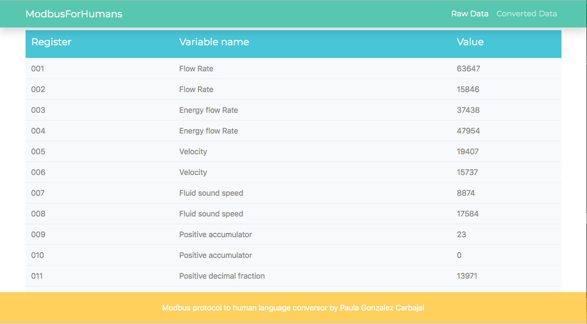
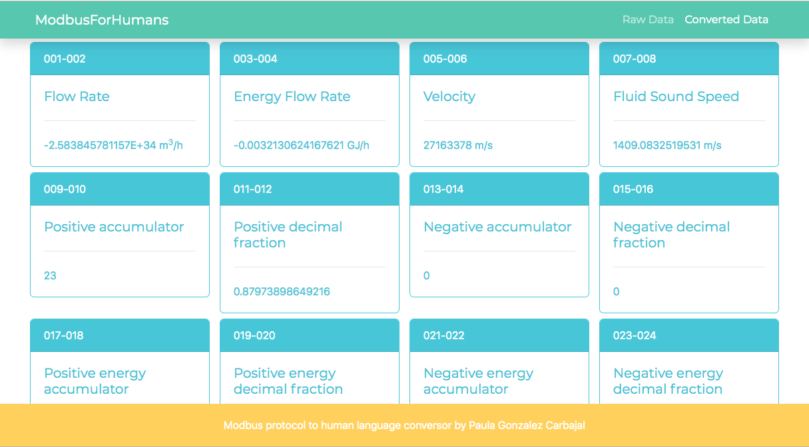

# ModbusForHumans
> ModbusForHumans is a web app for retrieving and converting data with Modbus format.

## Table of contents
* [General info](#general-info)
* [Screenshots](#screenshots)
* [Technologies](#technologies)
* [Demo](#demo)
* [Contact](#contact)

## General info
This project converts data retrieved from an Ultrasonic Flow Meter type TUF-2000M that uses a Modbus interface to a "human readable" information.

## Screenshots

## Technologies
* PHP  - version 7.2.7
* CodeIgniter - version 3.1.10
* Bootstrap - version 4.3.1
* HTMl
* CSS

## Demo
Demo version in http://modbusforhumans.freesite.vip/modbusforhumans/

## Contact
Created by [@paulagc](https://www.linkedin.com/in/paula-gonzalez-carbajal/)